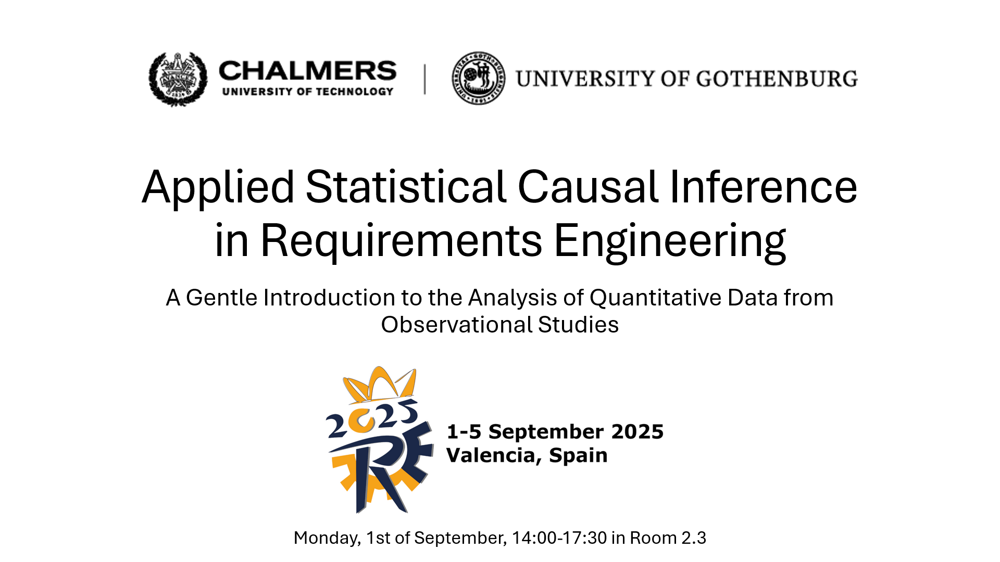

# Introduction to Statistical Causal Inference

[](./LICENSE)
[](https://arxiv.org/abs/2511.03875)

This repository contains the material for the introduction seminar to Statistical Causal Inference (SCI).
The purpose of the seminar is to introduce software engineering researchers with a background in analysis of quantitative data to a causal framework for inferential statistics proposed by Judea Pearl[^1] and Richard McElreath.[^2]



## Versions and contributors

| Version | Date | Occasion | Contributors | Material |
|---|---|---|---|---|
| v1.0 | 2024-10-18 | Seminar at [UPC](https://gessi.upc.edu/en), Barcelona | [Julian Frattini](https://julianfrattini.github.io/) | [2024-10-18-seminar-upc.pdf](slides/pdf/2024-10-18-seminar-upc.pdf) |
| v2.0 | 2025-04-28 | Tutorial at the [RE'25 conference](https://conf.researchr.org/track/RE-2025/RE-2025-tutorials) | Julian Frattini, [Hans-Martin Heyn](https://martinheyn.github.io/), [Robert Feldt](https://www.cse.chalmers.se/~feldt/), [Richard Torkar](https://torkar.github.io/) | [2025-04-28-tutorial-reconf.pdf](slides/pdf/2025-04-28-tutorial-reconf.pdf) |
| v2.1 | 2026-01-20 | Guest lecture and seminar at [TUM Heilbronn](https://chn.tum.de/de/), Germany | Julian Frattini | [2026-01-20-guestlecture-tum.pdf](slides/pdf/2026-01-20-guestlecture-tum.pdf) and [2026-01-20-seminar-tum.pdf](slides/presentations/2026-01-20-seminar-tum.pptx) |

## Structure

The repository contains the following directories and files.

```
├── publicity : advertising material for the seminar
│   ├── banners: image files (from PowerPoint slides) for social media posts
│   ├── debriefing: summary of tutorial instances
│   └── screenshots: images from the slides for tutorial applications
├── slides : PowerPoint presentations for teaching the tutorial/seminars
│   ├── pdf: animation-free export of the presentations to PDF
│   └── presentations: complete slide decks for presentation
│       ├── 2024-10-18-seminar-upc.pptx: complete introduction to both SCI and BDA
│       ├── 2025-04-28-tutorial-reconf.pptx: conference tutorial introducing to SCI
│       ├── 2026-01-20-guestlecture-tum.pptx: guest lecture introducing to SCI
│       └── 2026-01-20-seminar-tum.pptx: guest lecture focusing on causal modeling
└── src : source code to follow along the examples
│   ├── basics : description of fundamental concepts
│   │   ├── regression.Rmd : demonstration of the basic statistical analysis tool
│   │   └── simulations.Rmd : demonstration of ground truth simulations
│   ├── bda : implementations of BDA concepts and techniques
│   │   ├── brms : code snippets using the brms package
│   │   │   └── bda-complete.Rmd : complete example of a simple Bayesian regression model
│   │   └── rethinking : code snippets using the rethinking package
│   │       ├── prior-predictive-checks.Rmd : demonstration of prior predictive checks 
│   │       └── model-notation.Rmd : demonstration of statistical model specification
│   ├── exercises : collections of exercises to test the acquired skills
│   │   └── exercise-d-separation.Rmd : collection of exercises in identifying adjustment sets
│   ├── sci : implementations of SCI concepts and techniques
│   │   ├── associations : explanation of the fundamental relationships between three variables
│   │   │   ├── collider.Rmd : demonstration of a common effect
│   │   │   ├── confounder.Rmd : demonstration of a common cause
│   │   │   └── mediator.Rmd : demonstration of a pipe
│   │   ├── dag.Rmd : demonstration of causal modeling with directed, acyclic graphs
│   │   └── model-comparison.Rmd : demonstration of model comparison to identify appropriate causal models
│   └── util : utility files and scripts with reused functions
│       └── extract-coefficients.R : script to extract all coefficient distributions from two models
└── sci-intro.Rproj : project file to open the project in RStudio
```

## System Requirements

In order to run the `R` scripts and `Rmd` notebooks in the _src_ folder, ensure that you have [R](https://ftp.acc.umu.se/mirror/CRAN/) (version > 4.0) and an appropriate IDE like  [RStudio](https://posit.co/download/rstudio-desktop/#download) installed on your machine.
Then, ensure the following steps:

1. Install the C toolchain by following the instructions for [Windows](https://github.com/stan-dev/rstan/wiki/Configuring-C---Toolchain-for-Windows#r40), [Mac OS](https://github.com/stan-dev/rstan/wiki/Configuring-C---Toolchain-for-Mac), or [Linux](https://github.com/stan-dev/rstan/wiki/Configuring-C-Toolchain-for-Linux) respectively.
2. Restart RStudio and follow the instructions starting with the [Installation of RStan](https://github.com/stan-dev/rstan/wiki/RStan-Getting-Started#installation-of-rstan)
3. Install the latest version of `stan` by running the following commands
```R
    install.packages("devtools")
    devtools::install_github("stan-dev/cmdstanr")
    cmdstanr::install_cmdstan()
```
4. Install all required packages via `install.packages(c("tidyverse", "ggdag", "brms", "marginaleffects", "patchwork"))`.
5. Create a folder called *fits* within *src/* such that `brms` has a location to place all Bayesian models.
6. Open the `sci-intro.Rproj` file with RStudio which will setup the environment correctly.

## License

Copyright © 2024 Julian Frattini. 
This work is licensed under the [Apache-2.0](./LICENSE) License.

[^1]: Pearl, J., & Mackenzie, D. (2018). The book of why: the new science of cause and effect. Basic books.
[^2]: McElreath, R. (2018). Statistical rethinking: A Bayesian course with examples in R and Stan. Chapman and Hall/CRC.
